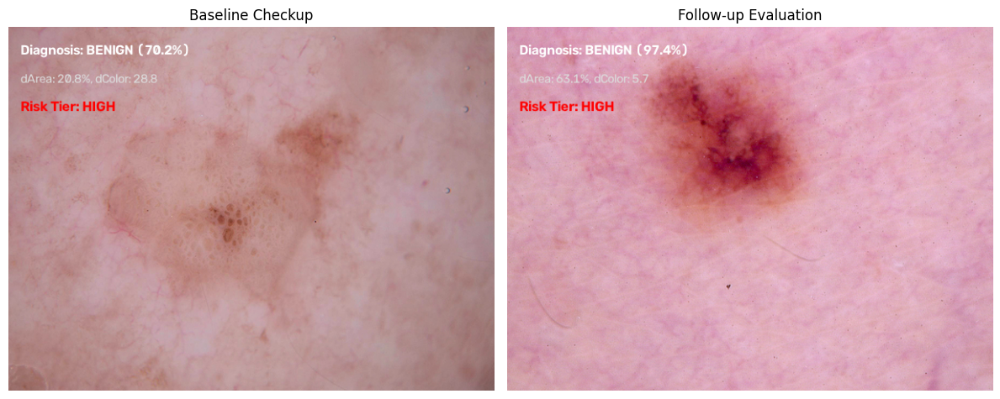

# Skin Lesion Progression Tracking Project

This project is a computer vision and machine learning pipeline built to track how skin lesions change over time. It takes historical check-up images from the HAM10000 dataset, cleans up background noise and hair, runs a classification check using MobileNetV2, and calculates how much the lesion has grown or changed in color to assign a clear risk level.

## 🛠️ How the Pipeline Works

### 1. Image Segmentation (Cleaning the Photos)
Medical images often have dark outer corners, hair artifacts, or uneven lighting that confuse machine learning models. To fix this:
* The code converts images to the **YCrCb color space** and uses the **Cr channel** because it isolates skin tones and lesion boundaries much better than standard grayscale.
* It applies a Gaussian Blur and **Otsu's Thresholding** to create a binary mask.
* To remove stray pink dots and hair artifacts, it uses a contour filter to find all isolated shapes, **keeps only the single largest shape** (the main lesion), and wipes everything else completely black.

### 2. Deep Learning Classification
* The project uses **MobileNetV2** (loaded with pre-trained weights) as a feature extractor.
* A classification head with Global Average Pooling and a Dense layer is added to predict whether a lesion looks `benign` or `malignant`.

### 3. Measuring Changes (Progression Metrics)
Instead of just guessing if a lesion is changing, the code calculates exact changes across checkups:
* **Area Shift (`dArea`)**: Calculates the percentage change in the lesion's size compared to the training baseline. It uses absolute values so that shrinking or growing both flag a true physical change.
* **Color Shift (`dColor`)**: Calculates how much the average color of the lesion has shifted from the baseline to monitor changes in pigmentation or redness.

### 4. Setting the Risk Level
The code passes the calculated `dArea` and `dColor` values through a direct priority rule logic to flag the final progression risk tier:
* If changes are very minor, it maps to **LOW RISK**.
* If changes hit threshold boundaries, it dynamically scales up to **MEDIUM** or **HIGH RISK**.

---

## 📊 Results and Output

* **MobileNetV2 Baseline Accuracy**: **81.0%** on the validation split.

### Final Dashboard Output
The script generates a side-by-side visualization plot tracking a patient's progress over multiple check-ups. It overlays the deep learning diagnosis, the calculated delta statistics, and the assigned risk tier directly onto the visual screen:

---

## 💻 Tech Stack Used
Everything runs natively inside Google Colab (no extra pip installations required):
* **Languages**: Python 3
* **Libraries**: OpenCV (`cv2`), TensorFlow, Keras, NumPy, Pandas, Matplotlib, Seaborn
